# Car Rental Application with recommendations based on user prefferences and history renting - developed in React.js and Firebase.

Car Rental application in which the user can view the listed cars to be rented. Users can also filter the cars by multiple selections. Users, also can add several perks to the specific car they want to rent, but the prise goes up. If a car is rentered in a specific date range, it will appear indisponible for all the users. It is possible to submit a review and rating vote. Based on the rented cars, it is showing the users another recommend cars with equivalent specifications.  Another recommendation is made based on the specifications of the car chosen from the dropdown. In the user profile are displayed booking history and user credentials which can be modified. The second role of the application is to list cars to be rented. They can be added from a form if the user has the ability to list cars.   

## Available Scripts

In the project directory, you can run:

### `1. npm install`

Install all required dependencies.

### `3. npm start`

Runs the app.
Open [http://localhost:3000](http://localhost:3000) to view it in the browser.

## Print-Screens

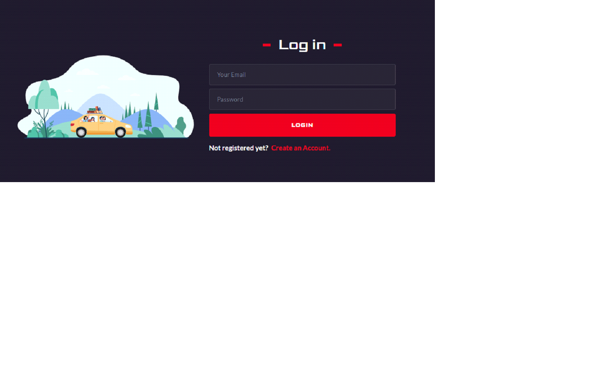
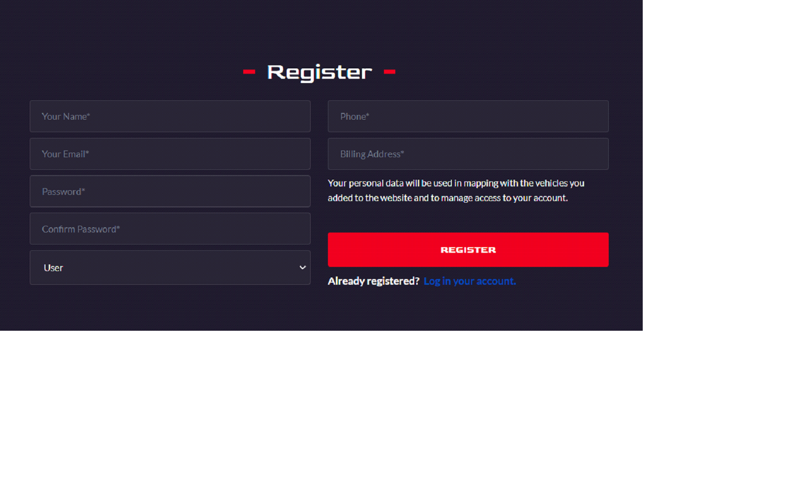
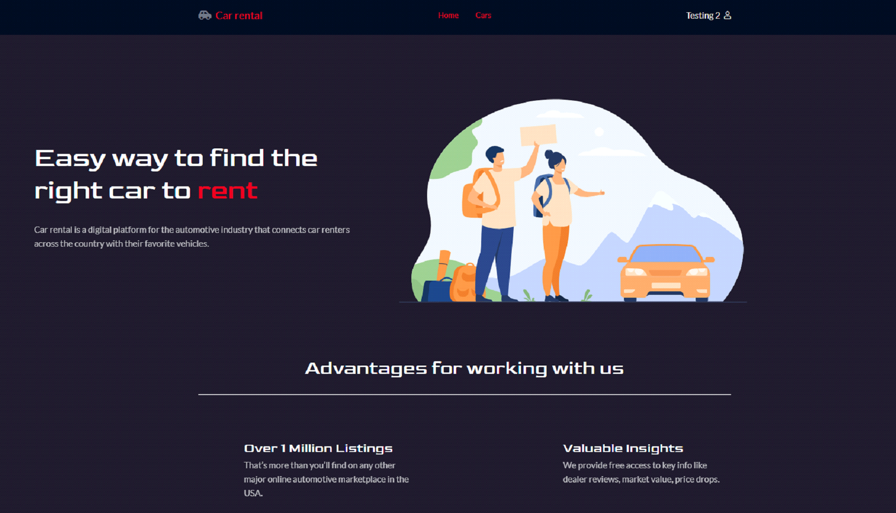
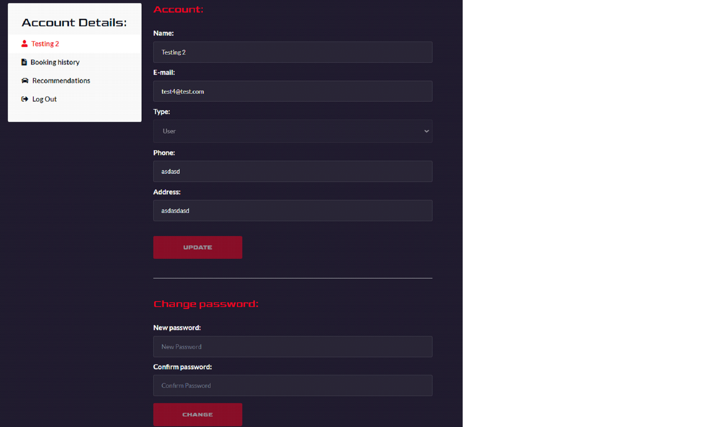
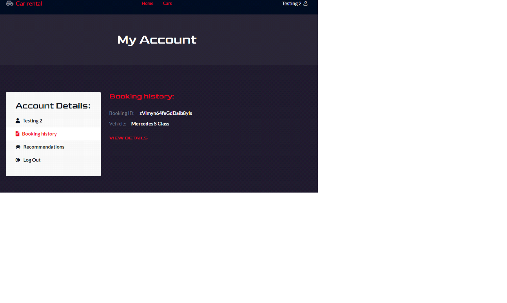
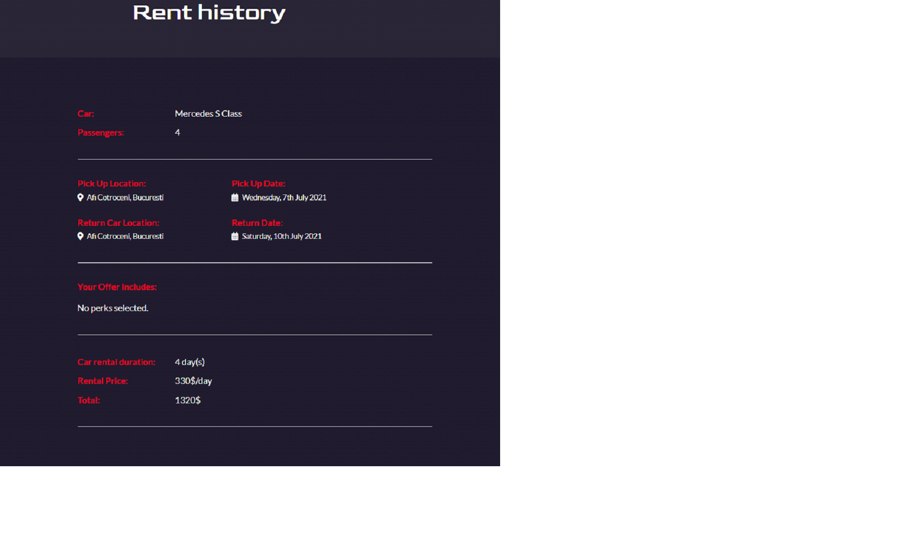
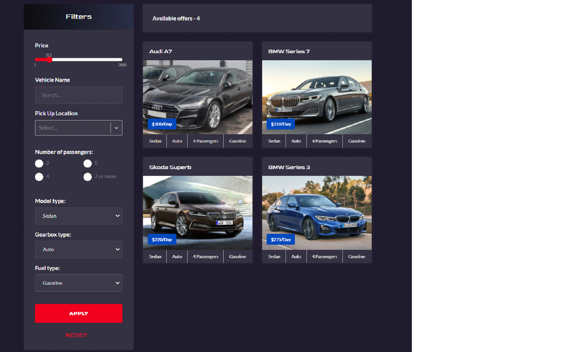
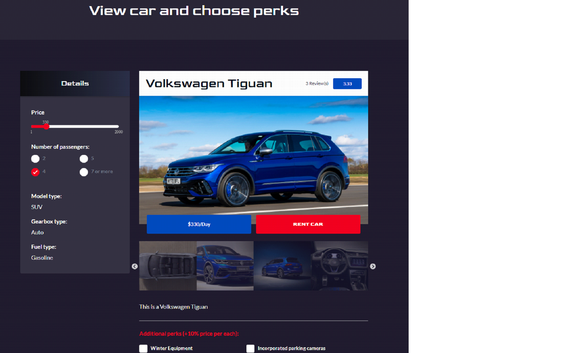
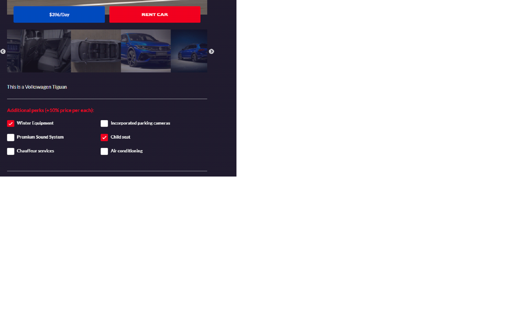
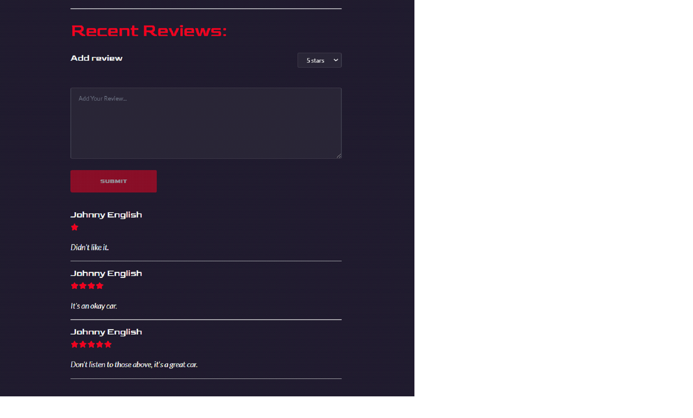
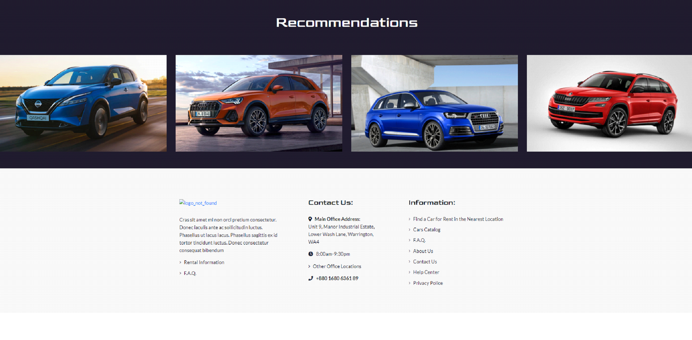

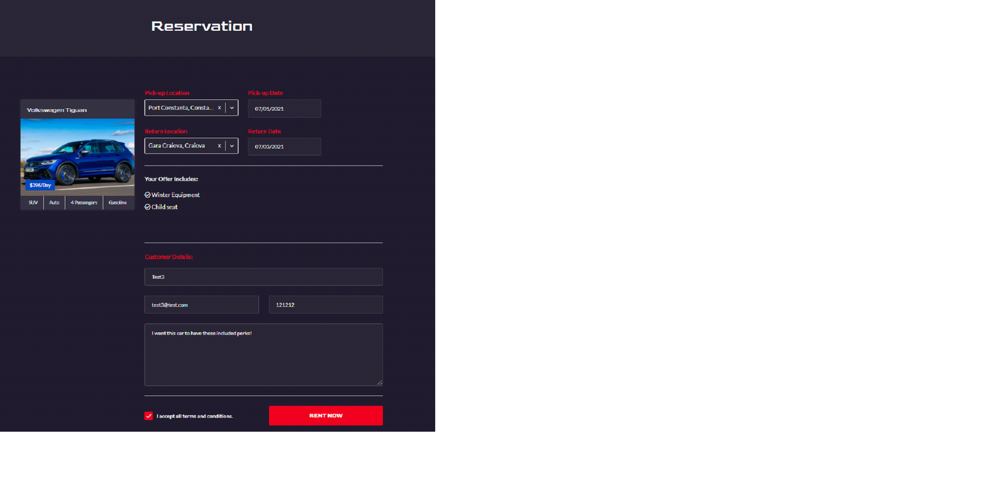

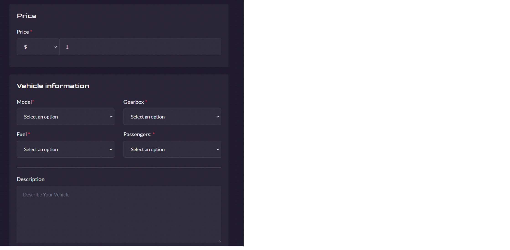

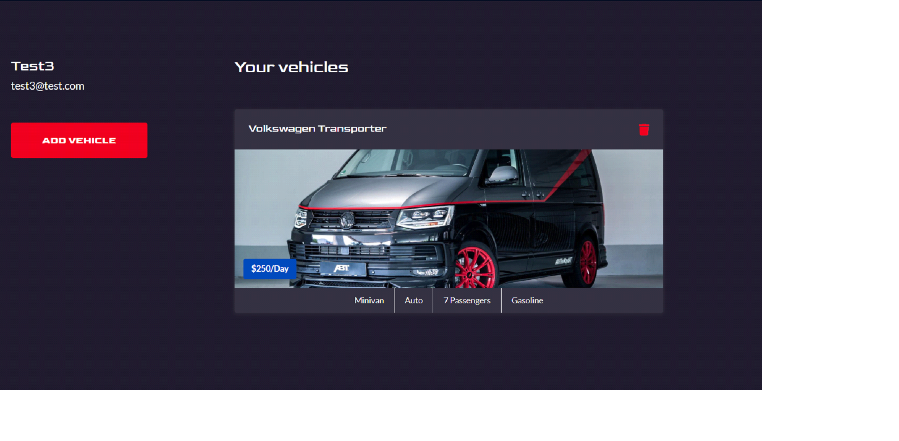
